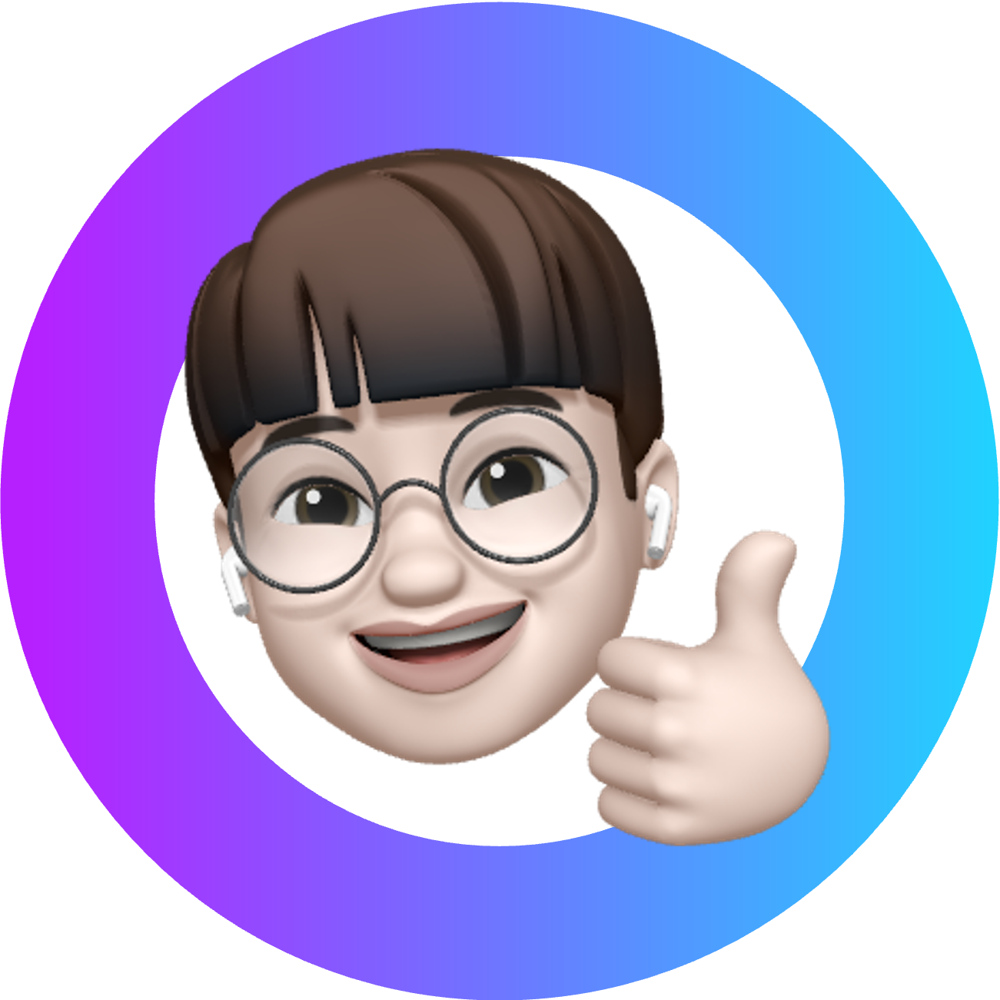

  
  <h1>👋🏻 Hi! I'm Wontory.</h1>
  
A Front-End Developer from South Korea

    
  
  
  
  

### Experiences

&ensp;<strong>CS-HOME</strong> 8th Team Leader 23.01 ~ Current

  
  > 

&ensp;<strong>APIS</strong> Frontend Developer 23.06 ~ 23.08

  
  > [Unieum](https://www.unieum.kr/) - [KYOWON AI Challenge 🥇](https://github.com/wontory/wontory/blob/master/documents/제2회%20교원그룹%20AI챌린지%20대회%20대상.pdf)  

&ensp;<strong>Dynamic Developer Designer</strong> 10th Web Frontend Developer 23.11 ~ 24.03

  
  > 

### Languages & Tools

